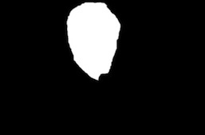

## computer-vision.
## Image analysis

 -  analysis.py - take input image array.
 
 -  Test_image - input image for analysis.
 
 -  results - output image.
### Results
-  Entropy 

-  Histogram

-  CDF

## Color Correction

- color_correction.py - takes input image array for color correction.

-  test_image - it contain input images to be tested.

- results - output of algorithm.

### Results

- corrected image

- corrected histogram

## Composite_Image

- composite.py - takes inputforground, background, and mask image array.

-  input - it contain input images.

      

- output - output of algorithm.

### Results

- composite image

## Enhancement

- enhance.py - takes input low contrast fogy image.

-  input - it contain input image.

  

- output - output of algorithm.

### Results

- contrast enhanced image

## Refrences

- [a link](https://opencv.org)

- [a link](https://www.pyimagesearch.com)

- [a link](https://in.mathworks.com)
